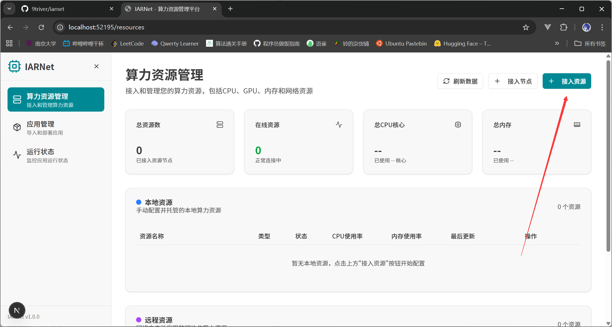

# TODO

## 快速开始

启动后端：

```shell
go mod download
go run cmd/main.go --config=config.yaml
```

启动前端：

```
cd ./web
npm install
npm run dev
```

## k8s provider 接入

实现接入接口




提交完成后会调用后端http接口：

> server/server.go#L37
>
> ```go
> s.router.HandleFunc("/resource/providers", s.handleRegisterProvider).Methods("POST")
> ```
>
> server/server.go#L608
>
> ```go
> func (s *Server) handleRegisterProvider(w http.ResponseWriter, req *http.Request)
> ```

需要根据前端输入使用go k8s库创建k8s客户端，前端输入应该满足创建客户端所必需的全部信息，如果现有实现中有缺失可以补充。

前端的请求格式：

> server/request/model.go#L16-L22
>
> ```go
> // RegisterProviderRequest 注册资源提供者请求结构
> type RegisterProviderRequest struct {
> 	Name   string      `json:"name"`   // 资源提供者名称
> 	Type   string      `json:"type"`   // "docker" or "k8s"
> 	Config interface{} `json:"config"` // 配置信息，根据类型不同而不同
> }
> ```

由于可能需要修改前端调用后端接口部分的代码实现，后端接口开发时建议使用postman调试，不必等待前端完成变更。

添加成功后，资源管理界面成功列出目标资源：


## k8s provider 实现

> resource/provider.go#L1-L27
>
> ```go
> package resource
> 
> import (
> 	"context"
> 	"time"
> )
> 
> type Status int32
> 
> const (
> 	StatusUnknown      Status = 0
> 	StatusConnected    Status = 1
> 	StatusDisconnected Status = 2
> )
> 
> type Provider interface {
> 	GetCapacity(ctx context.Context) (*Capacity, error)
> 	GetType() string
> 	GetID() string
> 	GetName() string
> 	GetHost() string
> 	GetPort() int
> 	GetLastUpdateTime() time.Time
> 	GetStatus() Status
> 	Deploy(ctx context.Context, spec ContainerSpec) (string, error)
> 	GetLogs(d string, lines int) ([]string, error)
> }
> ```

根据 provider 接口定义，参考已完成实现的 docker provdier，实现 k8s provider。这部分调试可以通过编写test单元测试完成。

