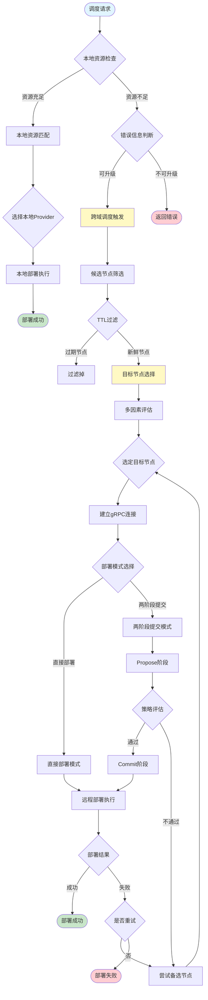

# 3.3.2 跨域算力组件调度框架

算力网络整合了云、边、端三域的硬件与软件能力，各域通常具有独立的资源管理机制。为在跨域环境中实现高效的应用执行，需要在应用执行引擎层面构建分层分级的资源池抽象，基于全局资源态势感知，支持跨域组件与任务的调度。本框架基于算力网络资源态势感知技术构建，采用分层分级的设计理念，通过清晰的架构、高效的调度策略、灵活的扩展机制，在复杂算力网络环境中实现调度逻辑的解耦、决策的优化以及系统可扩展性的提升。

## 3.3.2.1 资源管理节点模型与调度组件抽象

在点对点网络架构中，资源管理节点是算力网络资源态势感知的核心载体。每个节点作为自治的计算单元，负责管理本地直接连接的异构算力资源，并与对等节点协作实现全局资源发现与调度。本节详细阐述资源管理节点的模型定义及其核心调度组件的功能定位与交互机制。

### 资源管理节点模型

资源管理节点采用分层架构设计，逻辑上分为两层：上层为全局资源聚合层，负责协调跨域资源调度并维护全局资源视图；下层为本地资源管理层，专注于本地异构算力资源的细粒度管控。每个节点维护两类资源视图：本地直接管理资源，包括Docker容器集群、Kubernetes集群、裸金属服务器等；远程可发现资源，其使用信息通过Gossip协议在节点间传播与同步，形成全局资源视图。

节点模型的核心特征在于自治性与协作性的统一。节点内的自治性确保每个节点能够独立完成本地资源的分配与调度，当本地资源充足时，优先在本地完成组件部署，避免不必要的跨域通信开销。节点间的协作调度则使得节点在本地资源不足时，能够基于Gossip协议发现的全局视图，使用gRPC框架向目标节点发起资源请求，实现动态资源流转与全局优化配置。该设计有效解耦了全局调度优化与本地资源管理，避免了中心节点的性能与可靠性瓶颈，同时通过分布式协作机制保证了算力网络的整体服务能力与弹性。

### 调度服务组件：分级调度的核心抽象

调度服务组件（Scheduler Service）是资源管理节点中负责组件部署与调度的核心模块，提供统一的调度接口，支持本地调度和跨域调度两种模式。该组件采用分级调度策略，优先尝试本地资源调度，仅在本地资源不足时自动升级为跨域调度，实现了调度决策的层次化与智能化。

调度服务组件定义了统一的部署接口（`DeployComponent`），接受运行时环境类型（Runtime Environment）、资源需求（Resource Request）等参数，返回部署结果，包括组件标识符、节点信息、资源提供者标识符等。该接口支持本地部署和远程部署两种模式：当未指定目标节点时，在本地节点执行部署；当指定目标节点时，通过gRPC调用远程节点的调度服务完成跨域部署。调度服务组件还提供了两阶段提交机制（Propose-Commit），支持"只调度不部署"的调度提议阶段和确认部署阶段，为上层应用提供了更灵活的调度控制能力。

### 本地资源管理器：本地调度的执行引擎

本地资源管理器（Local Resource Manager）是资源管理节点中负责本地资源调度与组件部署的核心组件，负责管理本地资源提供者（Provider）的生命周期，执行本地资源调度决策，并在选定的资源提供者上完成组件的实际部署。该组件维护本地所有资源提供者的状态信息，包括资源容量、资源标签、连接状态等，为调度决策提供数据支撑。

本地资源管理器实现了本地资源调度接口（`ScheduleLocalProvider`），该接口根据资源需求在本地资源提供者中进行调度决策，返回选定的资源提供者及其可用资源信息，但不触发实际部署。该设计使得调度决策与部署执行解耦，支持两阶段提交机制，允许上层应用在确认调度结果后再执行实际部署。本地资源管理器还提供了在指定资源提供者上部署组件的接口（`DeployComponentOnProvider`），支持根据调度结果精确控制组件的部署位置，确保资源调度的准确性和可控性。

### 资源发现服务：跨域调度的信息基础

资源发现服务（Discovery Service）是资源管理节点中负责远程节点发现与资源信息同步的核心组件，基于Gossip协议实现分布式资源发现，为跨域调度提供全局资源视图。该服务维护已知节点的资源状态信息，包括节点标识符、节点地址、调度地址、资源容量、资源标签等，支持根据资源需求查询满足条件的可用节点。

资源发现服务提供了资源查询接口（`QueryResources`），根据资源需求和资源标签要求，从已知节点中筛选出满足条件的候选节点，返回节点列表及其资源信息。该接口支持资源标签匹配，能够根据应用需求（如需要GPU、需要摄像头等）筛选出具备相应硬件能力的节点，避免将任务调度到不满足硬件要求的节点。资源发现服务还维护节点的生存时间（TTL）信息，自动过滤掉长时间未更新的过期节点，确保跨域调度决策基于最新的资源状态信息。

## 3.3.2.2 分级调度策略：本地优先与跨域升级

分级调度框架采用"本地优先、跨域升级"的调度策略，优先在本地节点完成组件部署，仅在本地资源不足时自动升级为跨域调度。该策略在保证调度效率的同时，有效控制了跨域通信开销，实现了调度性能与资源利用率的平衡。

### 本地优先调度机制

本地优先调度机制是分级调度框架的第一级调度策略，其核心思想是优先利用本地资源完成组件部署，避免不必要的跨域通信。该机制通过高效的本地资源匹配算法和快速的部署执行流程，实现了低延迟、低开销的组件部署。

当调度服务接收到部署请求时，首先进行本地资源可用性检查。调度服务调用本地资源管理器的调度接口（`ScheduleLocalProvider`），传入资源需求（包括CPU、内存、GPU等）和运行时环境类型（如Docker、Kubernetes等）。本地资源管理器遍历本地所有已注册的资源提供者，根据资源容量、资源标签、连接状态等信息进行资源匹配。

资源匹配算法采用多维度评估策略：首先检查资源提供者的连接状态，仅考虑处于连接状态（Connected）的资源提供者；然后检查资源标签匹配，确保资源提供者支持所需的运行时环境类型和硬件能力（如GPU、摄像头等）；接着检查资源容量，确保资源提供者的可用资源满足资源需求，包括CPU、内存、GPU等各类资源的可用量；最后进行资源充足性评估，优先选择可用资源最充足的资源提供者，提高资源利用率和部署成功率。

如果本地存在满足资源需求的资源提供者，调度服务直接调用本地资源管理器的部署接口（`DeployComponent`），在选定的资源提供者上完成组件部署。部署过程包括组件创建、资源配额设置、容器启动等步骤，由资源提供者根据运行时环境类型执行相应的操作。部署成功后，调度服务返回部署结果，包括组件标识符、节点信息、资源提供者标识符等，完成本地优先调度流程。

本地优先调度机制的优势在于调度延迟低、通信开销小，能够充分利用本地资源，提高资源利用率。当本地资源充足时，整个调度过程完全在本地节点完成，无需跨域通信，调度响应时间显著降低，通常在毫秒级完成。该机制还支持资源标签匹配，能够根据应用需求（如运行时环境类型、硬件能力要求等）筛选出满足条件的本地资源提供者，确保组件部署在合适的资源环境中。

当本地资源不足时，本地资源管理器返回明确的错误信息，指示资源不足的原因（如CPU不足、内存不足、GPU不足等）。错误信息采用结构化格式，包含资源类型、需求数量、可用数量等详细信息，为上层应用提供准确的资源状态反馈。调度服务根据错误信息判断是否需要升级为跨域调度：如果错误信息包含特定的资源不足标识（如"failed to find available provider"），调度服务自动触发跨域调度流程；否则，调度服务直接返回错误信息，由上层应用决定后续处理策略。该设计使得调度决策更加灵活，允许上层应用根据业务需求选择是否进行跨域调度。

本地优先调度机制还支持两阶段提交模式，允许上层应用先进行调度决策，确认调度结果后再执行实际部署。该模式通过`ProposeLocalSchedule`接口实现"只调度不部署"的调度提议，返回选定的资源提供者及其可用资源信息，上层应用可以根据调度结果进行策略评估，决定是否执行部署。确认部署时，调用`CommitLocalSchedule`接口，在指定的资源提供者上完成组件部署。该模式为上层应用提供了更灵活的调度控制能力，支持复杂的调度策略和资源优化需求。

### 跨域调度触发与目标节点选择

跨域调度机制是分级调度框架的第二级调度策略，当本地资源不足时自动触发。跨域调度流程包括四个关键步骤：触发条件判断、候选节点筛选、目标节点选择、远程部署执行。

触发条件判断基于本地调度的错误信息，当本地资源管理器返回包含特定错误标识的资源不足错误时，调度服务自动判断需要升级为跨域调度。触发条件包括：错误信息包含"failed to find available provider"标识，表示本地无法找到满足资源需求的资源提供者；错误信息包含"no available provider"标识，表示本地没有可用的资源提供者；错误信息包含资源不足的详细描述，如CPU、内存、GPU等资源不足。该机制确保了跨域调度仅在必要时触发，避免了不必要的跨域通信开销，同时保证了调度决策的准确性和及时性。

候选节点筛选基于资源发现服务提供的全局资源视图，调度服务调用资源发现服务的资源查询接口（`QueryResources`），传入资源需求和资源标签要求。资源发现服务遍历所有已知节点，根据节点的资源容量、资源标签、节点状态等信息进行初步筛选。筛选条件包括：节点状态必须为在线（Online），确保节点可用；节点的可用资源必须满足资源需求，包括CPU、内存、GPU等各类资源；节点的资源标签必须匹配应用需求，如支持所需的运行时环境类型、具备所需的硬件能力等。

目标节点选择策略采用多因素综合评估，对候选节点进行排序和选择。评估因素包括：调度地址可用性，优先选择具备调度地址（SchedulerAddress）的节点，确保能够通过gRPC协议完成远程部署，如果节点没有调度地址，则使用节点地址（Address）作为备选；资源充足性，在具备调度地址的节点中，优先选择可用资源最多的节点，提高资源利用率和部署成功率；节点新鲜度，考虑节点的生存时间（TTL），自动过滤掉长时间未更新的过期节点，确保调度决策基于最新的资源状态；网络距离，考虑节点间的网络延迟和带宽，优先选择网络距离较近的节点，降低跨域通信开销。

目标节点选择还支持资源标签匹配，能够根据应用需求筛选出具备相应硬件能力的节点。例如，对于需要GPU加速的应用，调度服务会优先选择具备GPU资源的节点，并确保GPU的可用数量满足应用需求；对于需要摄像头硬件的应用，调度服务会优先选择具备摄像头能力的节点；对于需要特定运行时环境的应用，调度服务会优先选择支持该运行时环境的节点。该机制确保了组件部署在满足硬件要求的节点上，提高了应用执行的成功率和性能。

目标节点选择还支持多节点备选机制，当首选节点部署失败时，自动尝试备选节点，提高跨域调度的成功率。调度服务维护候选节点列表，按照评估分数排序，优先选择分数最高的节点，如果部署失败，则依次尝试下一个节点，直到部署成功或所有节点尝试完毕。该机制有效提高了跨域调度的容错能力和可靠性。

### 远程部署执行机制

远程部署执行是跨域调度的关键环节，负责在选定的远程节点上完成组件的实际部署。远程部署执行采用gRPC协议进行节点间通信，支持高效的远程过程调用和可靠的数据传输。

当目标节点选定后，调度服务首先建立与目标节点的gRPC连接。调度服务根据目标节点的调度地址（SchedulerAddress）或节点地址（Address）创建gRPC客户端连接，使用TLS加密确保通信安全。连接建立成功后，调度服务创建远程调度服务客户端（Scheduler Service Client），准备调用远程节点的部署接口。

远程部署执行支持两种模式：直接部署模式和两阶段提交模式。直接部署模式通过调用远程节点的`DeployComponent`接口，一次性完成组件部署，适用于简单的部署场景。两阶段提交模式通过先调用`ProposeRemoteSchedule`接口进行调度提议，获取远程节点的调度结果，然后调用`CommitRemoteSchedule`接口确认部署，适用于需要策略评估的复杂场景。

直接部署模式下，调度服务构造部署请求（`DeployComponentRequest`），包含运行时环境类型、资源需求、上游服务地址（ZMQ、Store、Logger）等信息。调度服务将请求发送到远程节点，远程节点执行本地调度和部署流程，返回部署结果。如果部署成功，远程节点返回组件信息、节点信息、资源提供者标识符等；如果部署失败，远程节点返回错误信息，调度服务根据错误信息决定是否尝试备选节点。

两阶段提交模式下，调度服务首先调用远程节点的`ProposeRemoteSchedule`接口，获取远程节点的调度结果，包括选定的资源提供者及其可用资源信息。调度服务根据调度结果进行策略评估，如资源安全裕度检查、成本评估等。如果策略评估通过，调度服务调用`CommitRemoteSchedule`接口确认部署，远程节点在指定的资源提供者上完成组件部署。如果策略评估不通过，调度服务可以尝试其他节点或返回错误信息。

远程部署执行还支持超时控制和重试机制，确保部署过程的可靠性。调度服务为每个远程部署请求设置超时时间，如果远程节点在超时时间内未响应，调度服务自动取消请求并尝试备选节点。重试机制支持在部署失败时自动重试，提高部署成功率。重试策略包括固定间隔重试、指数退避重试等，根据错误类型和网络条件选择合适的重试策略。

远程部署执行还支持部署状态查询，允许上层应用查询远程部署的状态。调度服务提供`GetDeploymentStatus`接口，根据组件标识符和节点标识符查询部署状态，包括部署中、运行中、已停止、错误等状态。该机制为上层应用提供了部署过程的可见性，支持部署监控和故障诊断。

### 过期节点清理机制

过期节点清理机制是跨域调度的重要组成部分，确保调度决策基于最新的资源状态信息。资源发现服务维护每个已知节点的最后更新时间（LastSeen），当节点的生存时间超过预设的TTL阈值时，该节点被视为过期节点，不再参与跨域调度决策。

过期节点清理机制在目标节点选择过程中自动执行，调度服务在筛选候选节点时，自动过滤掉超过TTL阈值的过期节点，确保只考虑活跃的、资源状态信息最新的节点。该机制有效避免了将任务调度到已失效或资源状态已变化的节点，提高了跨域调度的成功率和可靠性。

TTL阈值可以根据网络环境和业务需求进行配置，在网络延迟较大的环境中，可以适当增大TTL阈值，避免因网络延迟导致的误判；在网络稳定的环境中，可以适当减小TTL阈值，提高资源状态信息的时效性。该机制在保证调度准确性的同时，提供了灵活的配置能力，适应不同的网络环境和业务场景。

## 3.3.2.3 Actor动态迁移与卸载机制

Actor动态迁移与卸载机制是分级调度框架的重要组成部分，支持运行中的Actor在不同节点间的动态迁移，以及不再需要的Actor的卸载，实现了算力资源的动态调整与优化配置。该机制通过灵活的迁移策略和可靠的卸载流程，确保了算力网络资源的动态平衡和高效利用。

Actor初始部署基于分级调度策略，优先在本地节点完成部署，如果本地资源不足，则升级为跨域调度。调度服务根据Actor的资源需求（包括CPU、内存、GPU等）和运行时环境要求（如Docker、Kubernetes等），在合适的节点上完成Actor及其组件的部署。组件创建过程包括容器镜像拉取、容器启动、资源配额设置等步骤，由资源提供者根据运行时环境类型执行相应的操作。对于Docker运行时环境，资源提供者通过Docker Engine API创建容器并设置资源限制；对于Kubernetes运行时环境，资源提供者通过Kubernetes客户端库创建Pod并配置资源请求和限制。

Actor动态迁移机制支持将运行中的Actor从一个节点迁移到另一个节点，采用"先部署后卸载"的策略，确保Actor服务的连续性。迁移过程包括资源检查、新实例部署、流量切换、旧实例卸载等关键步骤。首先，调度服务检查目标节点的资源可用性，确保目标节点有足够的资源支持新Actor实例的运行。然后，调度服务在目标节点部署新的Actor实例，包括组件创建和Actor实例化。新实例部署成功后，调度服务等待新实例就绪，完成流量切换，确保服务的连续性。最后，调度服务在源节点卸载旧的Actor实例，释放资源，完成迁移过程。迁移触发条件包括源节点资源负载过高、源节点计划维护、目标节点资源更充足、网络优化需求等多种场景。调度服务可以根据这些条件自动触发迁移流程，或由上层应用根据业务需求主动触发迁移。

Actor卸载机制支持卸载不再需要的Actor及其组件，释放占用的计算资源。卸载触发条件包括应用下线、任务完成、资源优化等多种场景。卸载过程包括Actor停止、组件清理、资源释放等关键步骤。首先，调度服务停止Actor实例，确保Actor正常退出，避免数据丢失。停止过程包括发送停止信号、等待Actor完成当前任务、保存必要状态等操作，确保Actor优雅退出。然后，调度服务清理组件资源，包括容器删除、资源配额释放等操作。最后，调度服务更新资源视图，释放占用的资源，完成卸载过程。分级调度框架还支持多个Actor的并发迁移和卸载操作，能够同时处理多个Actor的调度请求，提高系统的并发处理能力。调度服务维护Actor部署信息，包括Actor标识符、节点信息、组件信息等，支持快速查询和更新，为并发操作提供数据支撑。

