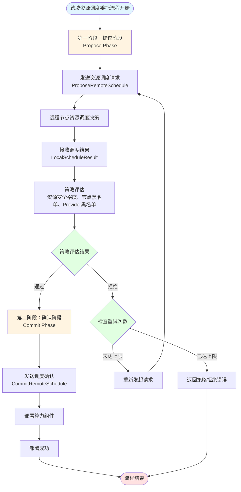

# 3.3.3 算力网络资源调度委托技术

在跨域算力组件调度框架中，当本地节点需要将任务调度到远程节点时，需要建立可靠的委托调度机制，确保调度决策的正确性和部署过程的可靠性。算力网络资源调度委托技术采用两阶段提交（Two-Phase Commit）机制，通过"提议-确认"的流程，支持策略评估和本地决策，实现了跨域调度的安全性和可控性。该技术使得本地节点能够对远程节点的调度结果进行评估和验证，确保调度决策符合本地策略要求，同时支持灵活的调度模式和高效的资源利用。

## 3.3.3.1 两阶段提交机制：提议与确认

两阶段提交机制是算力网络资源调度委托技术的核心，通过将调度过程分为提议（Propose）和确认（Commit）两个阶段，实现了调度决策与部署执行的解耦，为策略评估和本地决策提供了基础支撑。

### 提议阶段：远程调度结果获取

提议阶段（Propose Phase）是两阶段提交的第一阶段，本地节点通过远程过程调用（RPC）向目标节点发起调度提议，获取远程节点的调度结果，但不触发实际部署。该阶段的核心目标是获取远程节点的调度决策信息，包括选定的资源提供者、可用资源信息等，为本地节点的策略评估提供数据基础。

本地节点调用`ProposeRemoteSchedule`接口，传入目标节点标识符、目标节点地址、运行时环境类型、资源需求等参数。调度服务根据目标节点标识符查找目标节点的调度地址（SchedulerAddress）或节点地址（Address），建立与目标节点的gRPC连接。连接建立成功后，调度服务创建远程调度服务客户端，调用远程节点的`ProposeLocalSchedule`接口，传入资源需求信息。

远程节点接收到调度提议后，执行本地资源调度流程，根据资源需求在本地资源提供者中进行调度决策。远程节点遍历本地所有已注册的资源提供者，根据资源容量、资源标签、连接状态等信息进行资源匹配，选择最合适的资源提供者。调度决策完成后，远程节点返回调度结果，包括节点标识符、节点名称、选定的资源提供者标识符、可用资源信息等，但不执行实际部署。

本地节点接收到远程节点的调度结果后，将结果封装为`LocalScheduleResult`对象，包含节点信息、资源提供者信息、可用资源信息等。该结果作为策略评估的输入，供本地节点进行策略评估和决策。提议阶段的设计使得本地节点能够在实际部署之前评估远程调度结果，确保调度决策符合本地策略要求，避免了部署后才发现不符合策略的情况。

### 确认阶段：策略评估与部署确认

确认阶段（Commit Phase）是两阶段提交的第二阶段，本地节点根据策略评估结果决定是否确认部署。如果策略评估通过，本地节点调用`CommitRemoteSchedule`接口确认部署，远程节点在指定的资源提供者上完成组件的实际部署；如果策略评估不通过，本地节点可以拒绝部署或重新发起调度提议。

策略评估是确认阶段的关键环节，本地节点使用策略链（Policy Chain）对远程调度结果进行评估。策略链由多个策略组成，按顺序执行，每个策略对调度结果进行评估，返回接受（Accept）或拒绝（Reject）的决策。如果所有策略都返回接受决策，策略评估通过，可以进入部署确认流程；如果任何一个策略返回拒绝决策，策略评估失败，需要拒绝部署或重新调度。

策略评估上下文（Policy Context）包含远程调度结果信息、资源需求信息、本地节点信息等，为策略评估提供完整的数据支撑。策略根据评估上下文进行决策，例如资源安全裕度策略检查可用资源是否满足安全裕度要求，节点黑名单策略检查目标节点是否在黑名单中，资源提供者黑名单策略检查选定的资源提供者是否在黑名单中等。

如果策略评估通过，本地节点构造确认部署请求（`CommitLocalScheduleRequest`），包含运行时环境类型、资源需求、资源提供者标识符、上游服务地址等信息。调度服务调用远程节点的`CommitLocalSchedule`接口，传入确认部署请求。远程节点接收到确认请求后，在指定的资源提供者上执行组件部署，包括组件创建、资源配额设置、容器启动等步骤。部署成功后，远程节点返回部署结果，包括组件信息、节点信息、资源提供者标识符等。

如果策略评估不通过，本地节点可以拒绝部署，返回策略拒绝的原因，由上层应用决定后续处理策略。本地节点还可以重新发起调度提议，获取新的调度结果，再次进行策略评估，直到找到满足策略要求的调度结果或达到最大重试次数。该机制有效提高了跨域调度的成功率，确保了调度决策的质量和可靠性。

## 3.3.3.2 策略评估机制：策略链与决策逻辑

策略评估机制是算力网络资源调度委托技术的重要组成部分，通过策略链的方式组织多个策略，对远程调度结果进行评估，确保调度决策符合本地策略要求。该机制支持灵活的策略配置和扩展，能够适应不同的业务场景和策略需求。

### 策略链设计

策略链（Policy Chain）是策略评估机制的核心数据结构，由多个策略组成，按顺序执行。策略链采用"短路"评估策略，即遇到第一个拒绝决策即返回，不再执行后续策略，提高了评估效率。策略链支持动态添加和移除策略，允许根据业务需求灵活配置策略组合。

策略链的执行过程包括策略遍历、策略评估、决策聚合等步骤。首先，策略链按顺序遍历所有策略，对每个策略调用评估接口，传入策略评估上下文。每个策略根据评估上下文进行决策，返回接受或拒绝的决策结果，以及决策原因。如果策略返回拒绝决策，策略链立即返回拒绝结果，不再执行后续策略；如果策略返回接受决策，策略链继续执行下一个策略。当所有策略都返回接受决策时，策略链返回接受结果，表示策略评估通过。

策略链的设计使得多个策略可以组合使用，实现复杂的策略逻辑。例如，资源安全裕度策略和节点黑名单策略可以组合使用，既检查资源是否满足安全裕度要求，又检查目标节点是否在黑名单中。策略链还支持策略的优先级排序，重要的策略可以放在前面执行，确保关键策略优先评估。

### 资源安全裕度策略

资源安全裕度策略（Resource Safety Margin Policy）是策略评估机制中的核心策略之一，用于检查远程节点的可用资源是否满足安全裕度要求。该策略要求可用资源至少是请求资源的指定倍数，例如CPU和内存的默认安全裕度为1.2倍，GPU的默认安全裕度为1.0倍，确保部署后有足够的资源余量，避免资源耗尽导致的系统故障。

资源安全裕度策略的评估过程包括CPU检查、内存检查、GPU检查等步骤。对于CPU资源，策略计算所需的安全裕度资源量（请求CPU × CPU安全裕度比例），然后检查可用CPU是否满足要求。如果可用CPU小于所需的安全裕度资源量，策略返回拒绝决策，并返回详细的拒绝原因，包括所需资源量、可用资源量等信息。对于内存和GPU资源，策略采用相同的检查逻辑，确保各类资源都满足安全裕度要求。

资源安全裕度策略的参数可以根据业务需求进行配置，包括CPU安全裕度比例、内存安全裕度比例、GPU安全裕度比例等。不同的应用场景可以设置不同的安全裕度比例，例如对于关键应用，可以设置较高的安全裕度比例，确保资源充足；对于普通应用，可以设置较低的安全裕度比例，提高资源利用率。该机制在保证资源安全性的同时，提供了灵活的配置能力，适应不同的业务需求。

### 节点与资源提供者黑名单策略

节点黑名单策略（Node Blacklist Policy）和资源提供者黑名单策略（Provider Blacklist Policy）是策略评估机制中的安全策略，用于防止将任务调度到不可靠的节点或资源提供者。节点黑名单策略检查目标节点是否在黑名单中，如果在黑名单中，策略返回拒绝决策，避免将任务调度到已知的不可靠节点。资源提供者黑名单策略检查选定的资源提供者是否在黑名单中，如果在黑名单中，策略返回拒绝决策，避免使用不可靠的资源提供者。

黑名单策略的评估过程包括黑名单查询、节点或资源提供者标识符匹配等步骤。策略维护一个黑名单列表，包含被标记为不可靠的节点标识符或资源提供者标识符。当策略接收到调度结果时，策略检查目标节点标识符或资源提供者标识符是否在黑名单中。如果在黑名单中，策略返回拒绝决策，并返回拒绝原因，说明节点或资源提供者在黑名单中；如果不在黑名单中，策略返回接受决策，允许继续调度。

黑名单策略支持动态更新，允许运维人员根据实际情况动态添加或移除黑名单中的节点或资源提供者。例如，当发现某个节点频繁故障时，可以将该节点添加到黑名单中，避免后续任务调度到该节点；当节点恢复正常后，可以将该节点从黑名单中移除，恢复对该节点的调度。该机制有效提高了系统的可靠性和安全性，避免了将任务调度到不可靠的资源节点。

## 3.3.3.3 本地决策模式：无自主调度能力场景

本地决策模式是算力网络资源调度委托技术的补充机制，适用于远程节点无自主调度能力的场景。在该模式下，本地节点通过获取远程节点的资源提供者列表，在本地进行调度决策，然后确认部署，实现了调度决策的本地化控制。

### 资源提供者列表获取

当远程节点无自主调度能力时，本地节点无法通过`ProposeRemoteSchedule`接口获取远程节点的调度结果。此时，本地节点可以调用`ListRemoteProviders`接口，获取远程节点的所有资源提供者列表及其资源信息，包括资源提供者标识符、资源提供者名称、资源提供者类型、连接状态、可用资源、总容量、已使用资源、资源标签等信息。

`ListRemoteProviders`接口支持可选的资源信息包含参数（`includeResources`），当该参数为`true`时，返回的资源提供者信息包含详细的资源信息，包括可用资源、总容量、已使用资源等；当该参数为`false`时，返回的资源提供者信息仅包含基本信息，不包含详细的资源信息。该设计使得本地节点可以根据需要选择是否获取详细的资源信息，在信息完整性和查询效率之间取得平衡。

资源提供者列表获取过程包括节点地址解析、gRPC连接建立、远程接口调用等步骤。本地节点根据目标节点标识符查找目标节点的调度地址或节点地址，建立与目标节点的gRPC连接。连接建立成功后，调度服务创建远程调度服务客户端，调用远程节点的`ListProviders`接口，传入资源信息包含参数。远程节点返回所有已注册的资源提供者列表及其资源信息，本地节点将结果封装为`ProviderListResponse`对象，供本地调度决策使用。

### 本地调度决策

获取到远程节点的资源提供者列表后，本地节点在本地进行调度决策，根据资源需求在资源提供者列表中选择最合适的资源提供者。本地调度决策过程包括资源提供者筛选、资源充足性评估、资源提供者排序等步骤。

资源提供者筛选过程根据资源需求对资源提供者列表进行初步筛选，仅保留满足资源需求的资源提供者。筛选条件包括：资源提供者必须处于连接状态（Connected），确保资源提供者可用；资源提供者的可用资源必须满足资源需求，包括CPU、内存、GPU等各类资源；资源提供者的资源标签必须匹配应用需求，如支持所需的运行时环境类型、具备所需的硬件能力等。

资源充足性评估过程对筛选后的资源提供者进行排序，优先选择资源最充足的资源提供者。评估因素包括：可用资源总量，优先选择可用资源最多的资源提供者，提高资源利用率和部署成功率；资源类型匹配度，优先选择资源类型与应用需求最匹配的资源提供者，如需要GPU的应用优先选择具备GPU的资源提供者；资源提供者类型，优先选择更可靠的资源提供者类型，如Kubernetes资源提供者通常比Docker资源提供者更可靠。

本地调度决策完成后，本地节点选定最合适的资源提供者，构造确认部署请求，调用`CommitRemoteSchedule`接口确认部署。远程节点在指定的资源提供者上执行组件部署，返回部署结果。该模式使得本地节点能够完全控制调度决策过程，确保调度决策符合本地策略要求，同时支持远程节点无自主调度能力的场景。

### 重试与容错机制

本地决策模式还支持重试和容错机制，当首次调度决策失败时，可以重新获取资源提供者列表，重新进行调度决策。重试机制支持固定间隔重试、指数退避重试等策略，根据错误类型和网络条件选择合适的重试策略。容错机制支持在资源提供者列表获取失败时，自动尝试备选节点或返回错误信息，提高了系统的可靠性和容错能力。

重试机制在调度决策失败时自动触发，包括资源提供者列表获取失败、资源提供者筛选无结果、部署确认失败等场景。当重试机制触发时，调度服务根据重试策略等待一定时间后重新执行调度流程，直到调度成功或达到最大重试次数。重试策略可以根据业务需求进行配置，包括最大重试次数、重试间隔、重试条件等参数，在调度成功率和系统性能之间取得平衡。

容错机制在系统异常时自动触发，包括网络连接失败、远程节点不可用、资源提供者状态异常等场景。当容错机制触发时，调度服务自动尝试备选节点或资源提供者，如果所有备选方案都失败，则返回错误信息，由上层应用决定后续处理策略。容错机制有效提高了系统的可靠性，避免了单点故障导致的调度失败。

## 3.3 章节小结

本章节系统阐述了面向算力网络的分级资源调度方法的核心技术体系，包括算力网络资源态势感知技术、跨域算力组件调度框架和算力网络资源调度委托技术三个关键技术模块。

算力网络资源态势感知技术为分级资源调度提供了基础支撑，通过异构资源统一抽象与适配机制实现了Docker、Kubernetes、进程、Unikernel等多样化计算资源的统一管理，通过基于Gossip协议的分布式资源发现与状态同步模型实现了广域动态环境下的全局资源视图构建，通过资源状态监控与健康检查机制确保了资源状态信息的准确性和时效性。该技术有效解决了算力网络中资源异构性、动态性和分布性的挑战，为上层调度决策提供了可靠的资源状态信息基础。

跨域算力组件调度框架基于资源态势感知技术，采用"本地优先、跨域升级"的分级调度策略，实现了高效的跨域组件调度。框架通过资源管理节点模型实现了自治性与协作性的统一，通过本地优先调度机制充分利用本地资源、降低调度延迟，通过跨域调度机制在本地资源不足时自动升级为跨域调度，通过Actor动态迁移与卸载机制实现了算力资源的动态调整与优化配置。该框架有效解耦了全局调度优化与本地资源管理，避免了中心节点的性能与可靠性瓶颈，同时通过分布式协作机制保证了算力网络的整体服务能力与弹性。

算力网络资源调度委托技术通过两阶段提交机制实现了跨域调度的安全性和可控性，通过策略评估机制确保了调度决策符合本地策略要求，通过本地决策模式支持了远程节点无自主调度能力的场景。该技术使得本地节点能够对远程节点的调度结果进行评估和验证，有效提高了跨域调度的成功率和可靠性，同时支持灵活的调度模式和高效的资源利用。

三个技术模块相互支撑、有机统一，共同构成了完整的分级资源调度技术体系。资源态势感知技术为调度框架提供了全局资源视图，调度框架基于资源视图实现了高效的跨域调度，委托调度技术确保了跨域调度的安全性和可控性。该技术体系有效解决了传统集中式调度架构的单点性能瓶颈、可靠性风险和可扩展性限制，实现了算力网络资源的全局优化配置和高效利用，为算力网络的应用部署和资源管理提供了坚实的技术基础。

